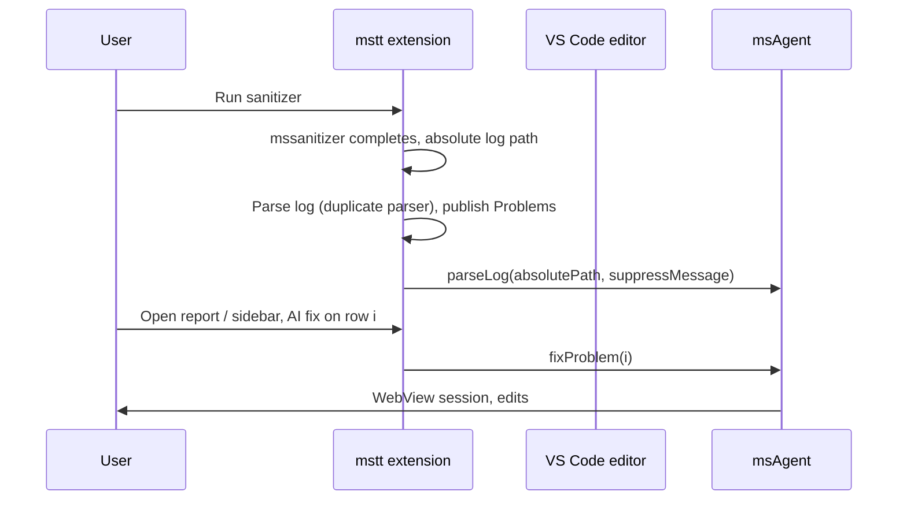

# msAgent ↔ OP DevTools (mstt) integration architecture

This document defines **separation of responsibilities**, the **integration API** between **mstt** (`plugin/src`) and **msAgent**, and **implementation guidance**. Product decisions agreed for the first integration iteration are in **§2**.

---

## 1. Goals

- **Single product UX**: Operators work in mstt (build, sanitizer run, report viewer, editor). AI repair is started from the sanitizer experience; msAgent provides the **fix session** (WebView, LLM, tools).
- **Thin integration surface**: mstt orchestrates visibility and calls VS Code commands; msAgent keeps **LLM settings**, **agent loop**, **tool execution**, and **fix-session UI**.
- **Minimal msAgent churn**: Integration should require **minimal changes** to msAgent; error handling and LLM behavior stay **msAgent’s responsibility** (owned by another team).

---

## 2. Agreed decisions (current iteration)

| # | Decision |
|---|----------|
| 1 | **Problems / editor diagnostics** are owned by **mstt** (`DiagnosticCollection`, source id for sanitizer). |
| 2 | Use **`msagent.fixProblem(index)`** only for now. **`fixWithPayload` is not in scope** for this iteration. |
| 3 | After a successful sanitizer run, the log is loaded into msAgent **automatically** (`msagent.parseLog` with **absolute** path, typically `suppressMessage: true`). **No extra user step** to sync the log. |
| 4 | If msAgent is **not** present: **hide AI fix** UI in mstt. When msAgent is published to the Marketplace, mstt may add an **install prompt**; **no `extensionDependencies` / extension id** until publication. |
| 5 | **No marketplace extension id** for msAgent yet — do **not** rely on `getExtension('<id>')` as the only gate. |
| 6 | Pass the log as an **absolute file system path** to `parseLog`. |
| 7 | **`index`** for `fixProblem` is the **sequential index** of the problem in the **original log file**, in the **same order** as msAgent’s `logParser` produces `diagnostics[]` for that file. mstt’s **duplicated parser** must preserve that order. |
| 8 | Use **absolute paths** for file references exchanged between plugins (e.g. diagnostic `Uri`, log path). |
| 9 | **AI fix** entry point **v1**: **sanitizer sidebar only** (no Operate-only flow, no editor Quick Fix in v1). |
| 10 | **Failure / LLM / timeout UX** stays **msAgent’s** current behavior; mstt does **not** change msAgent for this. |
| 11 | **Duplicated log parser** in mstt for now (copy semantics from msAgent `logParser`). Shared package / **removing parser from ms-agent** is a **future** cleanup. |
| 12 | Integration is gated by **`op-devtools.sanitizer.enableMsAgentAiFix`** (default off). Only users who **manually install** msAgent and enable this setting see AI actions. |
| 13 | **Telemetry / privacy**: out of scope for mstt integration spec; **msAgent team** owns. |

---

## 3. Responsibility split

| Area | **mstt** | **msAgent** |
|------|-----------|-------------|
| Run sanitizer / collect logs | Yes | No |
| Parse log for **Problems** + sidebar rows | Yes (duplicated parser, order §2.7) | No in integrated flow for Problems |
| **`parseLog` into msAgent** after successful run | Yes — automatic (§2.3) | Executes parse + internal diagnostics for **fixProblem** index |
| **Diagnostics in editor** | Yes | Not required for integrated UX |
| **AI fix** affordance (v1) | Yes — sidebar only | No duplicate buttons in msAgent for this flow |
| **Fix session UI** (stream, diff, cancel) | No | Yes |
| **Fix execution** (LLM, tools) | No | Yes |
| **LLM settings** | No | Yes (`msagent.*`) |

---

## 4. Data flow (v1)

---

## 5. msAgent commands used by mstt (v1)

| Command | Arguments | Notes |
|---------|-----------|--------|
| `msagent.parseLog` | `vscode.Uri` or string (**absolute** path), optional `{ suppressMessage?: boolean }` | Called automatically after successful run; also ensures `fixProblem` indices match parsed order. |
| `msagent.fixProblem` | `index` (0-based, **same order** as `logParser` on that log) | Invoked from sanitizer sidebar when feature flag + msAgent available. |

**Detecting msAgent without extension id:** e.g. test whether `msagent.parseLog` appears in `vscode.commands.getCommands(true)` after activation, or use a small **try/catch** around `executeCommand` — exact approach is an mstt implementation detail.

---

## 6. mstt implementation checklist (v1)

1. **Feature flag** — gate all AI UI and bridge calls.
2. **Duplicate memcheck log parser** — output array order **must match** msAgent `logParser` for the same file (§2.7).
3. **`DiagnosticCollection`** — publish Problems from parsed findings; **absolute** `Uri`s for files.
4. **`sanitizer-service.ts`** — on successful run, resolve **absolute** log path, then `executeCommand('msagent.parseLog', uri, { suppressMessage: true })` if flag + msAgent present.
5. **Bridge module** — `parseLog`, `fixProblem`, presence check; **hide** sidebar AI actions if not present.
6. **`ms-sanitizer-panel-view.ts`** (+ **web** sidebar) — **only** v1 entry for “AI fix”: `postMessage` → `fixProblem(index)` with **row index = parser order index**.
7. **No** `fixWithPayload`, **no** `extensionDependencies` until msAgent is published (§2.4–5).

---

## 7. msAgent implementation checklist (v1)

- **No required code changes** for v1 if `parseLog` + `fixProblem` already behave as today.
- Future: optional reduction of duplicate **Problems** publishing when only mstt owns editor diagnostics (coordinate to avoid double entries if both publish).

---

## 8. Future (out of scope for v1)

- **`fixWithPayload`** — stateless fix without relying on shared parse order.
- **Marketplace** msAgent id → `extensionDependencies` + install prompt.
- **Shared parser package**; remove parser from ms-agent or single source of truth.
- **Editor Quick Fix**, Operate panel actions.
- **Performance** and other non-memcheck fix kinds.

---

## 9. File references

| msAgent | mstt |
|---------|------|
| `src/parser/logParser.ts` (order reference) | `plugin/src/service/sanitizer-service.ts` |
| `src/extension.ts` (`parseLog`, `fixProblem`) | `plugin/src/class/ms-sanitizer-panel-view.ts` |
| `src/vscode/fixService.ts` | `plugin/specs/MSAGENT_PLUGIN_INTEGRATION.md` |

---

## 10. Summary

- **mstt** owns **Problems**, **sidebar UX**, **automatic `parseLog`**, and **duplicate parser order** aligned with msAgent.
- **msAgent** owns **fix session** and **`fixProblem(index)`** after the log is loaded; **minimal changes** expected.
- **v1** uses **index-only** API and **sanitizer-sidebar-only** AI fix, behind a **feature flag**, with **hidden** actions when msAgent is absent.
