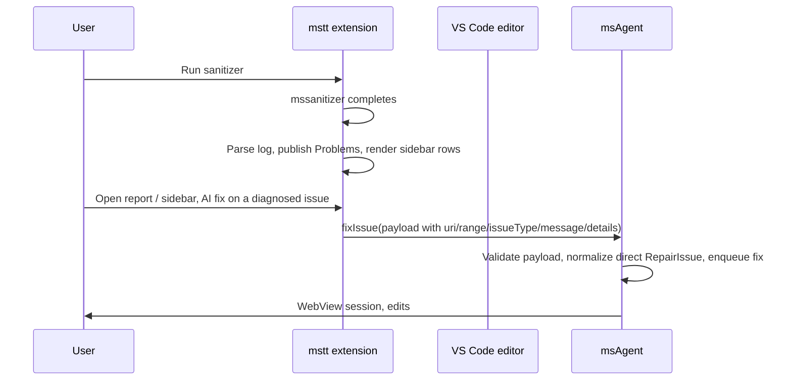

# msAgent ↔ OP DevTools (mstt) integration architecture

This document defines **separation of responsibilities**, the **integration API** between **mstt** (`plugin/src`) and **msAgent**, and **implementation guidance**. Product decisions agreed for the first integration iteration are in **§2**.

---

## 1. Goals

- **Single product UX**: Operators work in mstt (build, sanitizer run, report viewer, editor). AI repair is started from the sanitizer experience; msAgent provides the **fix session** (WebView, LLM, tools).
- **Thin integration surface**: mstt orchestrates visibility and calls VS Code commands; msAgent keeps **LLM settings**, **agent loop**, **tool execution**, and **fix-session UI**. mstt sends a caller-owned issue payload only when repair starts; there is no automatic log synchronization for the integrated flow.
- **Minimal msAgent churn**: Integration should require **minimal changes** to msAgent; error handling and LLM behavior stay **msAgent’s responsibility** (owned by another team).

---

## 2. Agreed decisions (current iteration)

| # | Decision |
|---|----------|
| 1 | **Problems / editor diagnostics** are owned by **mstt** (`DiagnosticCollection`, source id for sanitizer). |
| 2 | Use **`msagent.fixIssue(payload)`** for integration. mstt sends the already-diagnosed issue only when the user asks for AI repair; `fixProblem(index)` stays for standalone msAgent flows. |
| 3 | In the integrated flow, mstt does **not** call `msagent.parseLog`; msAgent does not parse the caller's log or own caller diagnostics. |
| 4 | If msAgent is **not** present: **hide AI fix** UI in mstt. When msAgent is published to the Marketplace, mstt may add an **install prompt**; **no `extensionDependencies` / extension id** until publication. |
| 5 | **No marketplace extension id** for msAgent yet — do **not** rely on `getExtension('<id>')` as the only gate. |
| 6 | Pass the issue target as an **absolute** file URI/path plus a VS Code-style zero-based `range` in the `fixIssue` payload. |
| 7 | There is no msAgent index contract for integration; mstt owns issue identity and row mapping. msAgent treats `fixIssue` requests as direct repair tasks, not parsed-log diagnostics. |
| 8 | Use **absolute paths** for file references exchanged between plugins (e.g. diagnostic `Uri`, stack frames). |
| 9 | **AI fix** entry point **v1**: **sanitizer sidebar only** (no Operate-only flow, no editor Quick Fix in v1). |
| 10 | **Failure / LLM / timeout UX** stays **msAgent’s** current behavior; mstt does **not** change msAgent for this. |
| 11 | mstt owns problem diagnosis and parser semantics for its UI. msAgent keeps its parser only for standalone use. |
| 12 | Integration is gated by **`op-devtools.sanitizer.enableMsAgentAiFix`** (default on; AI actions stay hidden when msAgent is absent). Only users who **manually install** msAgent see the AI actions while this setting is enabled. |
| 13 | **Telemetry / privacy**: out of scope for mstt integration spec; **msAgent team** owns. |
| 14 | **Per-issue progress channel** for `fixIssues` is the `op-devtools.msAgentFixIssuesProgress` command, registered by mstt and capability-detected by msAgent via `vscode.commands.getCommands(true)`. No `extension.exports`. |

---

## 3. Responsibility split

| Area | **mstt** | **msAgent** |
|------|-----------|-------------|
| Run sanitizer / collect logs | Yes | No |
| Parse log for **Problems** + sidebar rows | Yes | No in integrated flow |
| **`fixIssue` / `fixIssues` payload assembly** | Yes — on user repair request (single row or whole group) | Validates and normalizes each payload into a direct repair issue |
| **Diagnostics in editor** | Yes | Not required for integrated UX |
| **AI fix** affordance (v1) | Yes — sidebar only | No duplicate buttons in msAgent for this flow |
| **Repair queue state** | Optional result handling only | Owns queueing, duplicate suppression, cancellation, and fix-session state |
| **Fix session UI** (stream, diff, cancel) | No | Yes |
| **Fix execution** (LLM, tools) | No | Yes |
| **LLM settings** | No | Yes (`msagent.*`) |

---

## 4. Data flow (v1)



---

## 5. msAgent commands used by mstt (v1)

| Command | Arguments | Notes |
|---------|-----------|--------|
| `msagent.fixIssue` | `{ uri, range, issueType, message, severity?, details? }` | Invoked from sanitizer sidebar when feature flag + msAgent available. msAgent validates and enqueues the issue, but does not publish Problems for this payload. |
| `msagent.fixIssues` | `payloads: Array<{ uri, range, issueType, message, severity?, details? }>, options?: { batchId?, perTaskOptions? }` | Additive batch variant. mstt sends a set of issues (e.g. every leaf under a sidebar group node) and msAgent enqueues them as a single batch. The fix-queue still processes one at a time; the result reports per-issue status plus a summary. mstt should feature-detect by checking `vscode.commands.getCommands(true)` for `msagent.fixIssues` and fall back to sequential `fixIssue` calls when only the single-issue command is registered. |
| `op-devtools.msAgentFixIssuesProgress` (mstt-registered) | `{ batchId, index, status, completedCount, batchTotal, taskId?, title? }` | Optional receiver. mstt registers this command when its AI-fix feature flag is on. msAgent capability-detects via `vscode.commands.getCommands(true)` and calls it once per per-issue terminal status during a `fixIssues` batch. When the command is absent, msAgent skips notification — mstt's existing snapshot-polling path remains the only signal. No `extension.exports` lookup. |

Payload contract:

```ts
{
  uri: string | vscode.Uri; // absolute file path, file URI, or Uri with fsPath
  range: vscode.Range | {
    start: { line: number; character: number };
    end: { line: number; character: number };
  };
  issueType: string;
  message: string;
  severity?: 'Error' | 'Warning' | vscode.DiagnosticSeverity;
  details?: {
    address?: string;
    addressSpace?: string;
    byteSize?: number;
    kernelName?: string;
    stack?: Array<{ file: string; line: number; column?: number }>;
  };
}
```

Contract details:

- `range` uses VS Code coordinates: `line` and `character` are zero-based; msAgent converts the start line to the one-based repair line used by prompts.
- `severity` defaults to `Error`; invalid severity values return `invalid_payload`.
- `details` is optional enrichment for repair prompts. `stack` frames with missing `file` or one-based `line` are ignored.
- `executeCommand('msagent.fixIssue', payload)` resolves to a status such as `completed`, `no_change`, `failed`, `cancelled`, `stopped`, `already_running`, or `invalid_payload`. (`stopped` is returned when the user pauses the active session.) `invalid_index` and `out_of_range` belong to the legacy `fixProblem(index)` path and are not produced by `fixIssue`.

Batch result contract (`msagent.fixIssues`):

```ts
{
  batchId: string;            // auto-generated unless caller passes `options.batchId`
  total: number;              // length of the input payloads array
  accepted: number;           // payloads that passed validation and were enqueued
  results: Array<{
    index: number;            // position in the original payloads array
    status: 'completed' | 'no_change' | 'failed' | 'cancelled'
          | 'stopped' | 'already_running' | 'invalid_payload';
    error?: string;           // populated when status === 'invalid_payload'
    deduplicated?: true;      // marked when status === 'already_running' because the
                              // same file:line:errorType was already queued or active
  }>;
  summary: {
    completed: number;
    no_change: number;
    failed: number;
    cancelled: number;
    stopped: number;
    already_running: number;
    invalid_payload: number;
  };
}
```

Notes:

- Queue items that belong to a batch are surfaced through the existing AI-fix queue snapshot (`AiFixQueueSnapshot.items[].batchId / batchIndex / batchTotal` and `activeBatchId`) so the WebView and any caller-side progress UI can group them.
- The first task in a batch clears the WebView (matching `fixIssue`); subsequent tasks preserve session history so the user can review the batch end-to-end.
- Atomic batch cancel is not in v1 — mstt can either rely on the WebView's pause/cancel controls or cancel queued items individually via the queue snapshot. Per-issue progress reporting is the v1 deliverable.

**Detecting msAgent without extension id:** e.g. test whether `msagent.fixIssue` appears in `vscode.commands.getCommands(true)` after activation, or use a small **try/catch** around `executeCommand` — exact approach is an mstt implementation detail.

---

## 6. mstt implementation checklist (v1)

1. **Feature flag** — gate all AI UI and bridge calls.
2. **memcheck log parser / diagnosis** — mstt owns issue extraction, row identity, and display semantics.
3. **`DiagnosticCollection`** — publish Problems from parsed findings; **absolute** `Uri`s for files.
4. **Bridge module** — `fixIssue`, presence check, result status handling; **hide** sidebar AI actions if not present.
5. **Payload assembly** — send absolute `uri`, current row `range`, `issueType`, `message`, and optional `details` (`address`, `addressSpace`, `byteSize`, `kernelName`, `stack`) from the row's diagnosis data.
6. **`ms-sanitizer-panel-view.ts`** (+ **web** sidebar) — **only** v1 entry for "AI fix": `postMessage` -> `fixIssue(payload)` with the row's current diagnosis data.
7. **No** `extensionDependencies` until msAgent is published (§2.4–5).

---

## 7. msAgent implementation checklist (v1)

- Expose `msagent.fixIssue` and validate the direct payload in `repairIssue.ts`.
- Normalize accepted payloads into `RepairIssue` and enqueue them as direct tasks (`sanitizerIndex` is absent).
- Do not publish Problems or store mstt-owned diagnostics for `fixIssue`.
- Return `invalid_payload` and show a warning for malformed payloads; otherwise use the same WebView, queue, cancellation, backend, and LLM settings as normal repair sessions.
- Keep `parseLog` + `fixProblem` for standalone msAgent use.
- Expose `msagent.fixIssues` for batch repair. Each payload uses the same shape as `fixIssue`; the queue still processes one task at a time but every task in the batch carries a shared `batchId` so the snapshot and WebView can group them. The command returns a per-issue + summary result; invalid payloads short-circuit into the result without stopping the rest of the batch.

---

## 8. Future (out of scope for v1)

- **Marketplace** msAgent id → `extensionDependencies` + install prompt.
- **Shared parser package**; remove parser from ms-agent or single source of truth.
- **Editor Quick Fix**, Operate panel actions.
- **Performance** and other non-memcheck fix kinds.

---

## 9. File references

| msAgent | mstt |
|---------|------|
| `src/vscode/repairIssue.ts` (`fixIssue` payload shape) | `plugin/src/service/sanitizer-service.ts` |
| `src/extension.ts` (`fixIssue`) | `plugin/src/class/ms-sanitizer-panel-view.ts` |
| `src/vscode/fixService.ts` | `plugin/specs/MSAGENT_PLUGIN_INTEGRATION.md` |

---

## 10. Summary

- **mstt** owns **Problems**, **sidebar UX**, diagnosis, and issue identity.
- **msAgent** owns **fix session** and **`fixIssue(payload)`** repair execution.
- **v1** uses a **direct payload** API and **sanitizer-sidebar-only** AI fix, behind a **feature flag**, with **hidden** actions when msAgent is absent.
